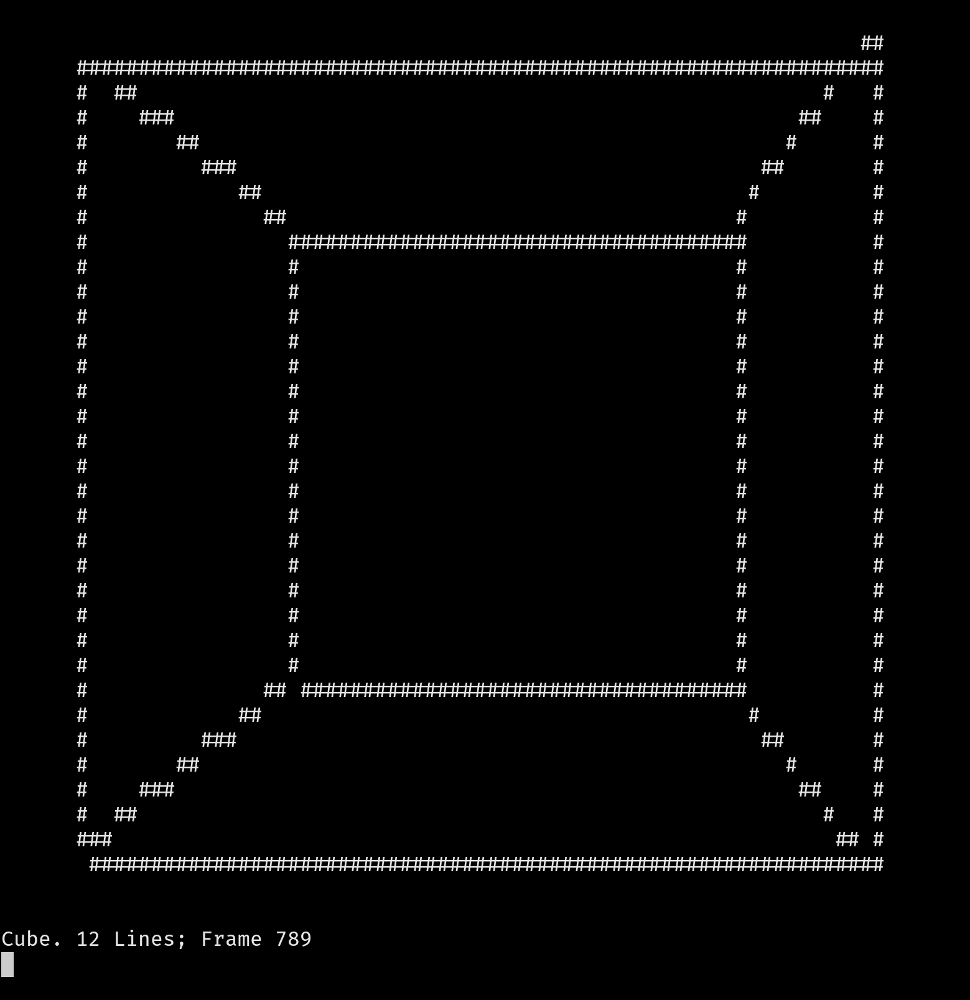

# cube



A animated cube in your terminal.

It supports [oblique](https://en.wikipedia.org/wiki/Isometric_projection) and [perspecive](https://en.wikipedia.org/wiki/Perspective_(graphical)) views.

## Requirements

- A working C compiler. (must have time.h,math.h,stdio.h)
- A terminal

## Building

```
make 3d
```

or

```
cc -o 3d main.c shape.c screen.c -lm
```

The binary will be called ``3d``, run ``./3d help`` for usage infomation.
